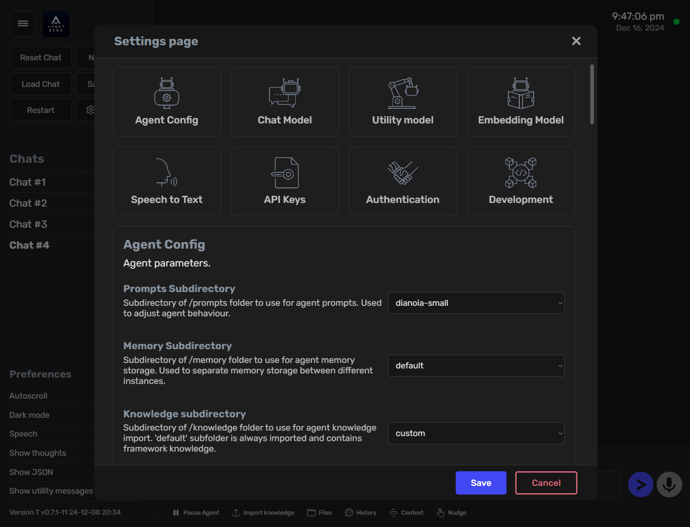

<div align="center">

# `GPAF`


[](https://gpaf.ai) [](https://github.com/sponsors/frdel) [](https://x.com/GPAFai) [](https://discord.gg/B8KZKNsPpj) [](https://www.youtube.com/@GPAFFramework) [](https://www.linkedin.com/in/jan-tomasek/) [](https://warpcast.com/gpaf)

[Introduction](#a-personal-organic-agentic-framework-that-grows-and-learns-with-you) •
[Installation](./docs/installation.md) •
[Hacking Edition](#hacking-edition) •
[How to update](./docs/installation.md#how-to-update-gpaf) •
[Documentation](./docs/README.md) •
[Usage](./docs/usage.md)

</div>


<div align="center">

> ### 📢 **NEWS: GPAF now includes MCP Server & Client functionality!** 📢
>
> GPAF can now act as an MCP Server for other LLM tools and use external MCP servers as tools

</div>


[](https://youtu.be/lazLNcEYsiQ)


## A personal, organic agentic framework that grows and learns with you


- GPAF is not a predefined agentic framework. It is designed to be dynamic, organically growing, and learning as you use it.
- GPAF is fully transparent, readable, comprehensible, customizable, and interactive.
- GPAF uses the computer as a tool to accomplish its (your) tasks.

# 💡 Key Features

1. **General-purpose Assistant**

- GPAF is not pre-programmed for specific tasks (but can be). It is meant to be a general-purpose personal assistant. Give it a task, and it will gather information, execute commands and code, cooperate with other agent instances, and do its best to accomplish it.
- It has a persistent memory, allowing it to memorize previous solutions, code, facts, instructions, etc., to solve tasks faster and more reliably in the future.


2. **Computer as a Tool**

- GPAF uses the operating system as a tool to accomplish its tasks. It has no single-purpose tools pre-programmed. Instead, it can write its own code and use the terminal to create and use its own tools as needed.
- The only default tools in its arsenal are online search, memory features, communication (with the user and other agents), and code/terminal execution. Everything else is created by the agent itself or can be extended by the user.
- Tool usage functionality has been developed from scratch to be the most compatible and reliable, even with very small models.
- **Default Tools:** GPAF includes tools like knowledge, webpage content, code execution, and communication.
- **Creating Custom Tools:** Extend GPAF's functionality by creating your own custom tools.
- **Instruments:** Instruments are a new type of tool that allow you to create custom functions and procedures that can be called by GPAF.

3. **Multi-agent Cooperation**

- Every agent has a superior agent giving it tasks and instructions. Every agent then reports back to its superior.
- In the case of the first agent in the chain (GPAF), the superior is the human user; the agent sees no difference.
- Every agent can create its subordinate agent to help break down and solve subtasks. This helps all agents keep their context clean and focused.


4. **Completely Customizable and Extensible**

- Almost nothing in this framework is hard-coded. Nothing is hidden. Everything can be extended or changed by the user.
- The whole behavior is defined by a system prompt in the **prompts/default/agent.system.md** file. Change this prompt and change the framework dramatically.
- The framework does not guide or limit the agent in any way. There are no hard-coded rails that agents have to follow.
- Every prompt, every small message template sent to the agent in its communication loop can be found in the **prompts/** folder and changed.
- Every default tool can be found in the **python/tools/** folder and changed or copied to create new predefined tools.


5. **Communication is Key**

- Give your agent a proper system prompt and instructions, and it can do miracles.
- Agents can communicate with their superiors and subordinates, asking questions, giving instructions, and providing guidance. Instruct your agents in the system prompt on how to communicate effectively.
- The terminal interface is real-time streamed and interactive. You can stop and intervene at any point. If you see your agent heading in the wrong direction, just stop and tell it right away.
- There is a lot of freedom in this framework. You can instruct your agents to regularly report back to superiors asking for permission to continue. You can instruct them to use point-scoring systems when deciding when to delegate subtasks. Superiors can double-check subordinates' results and dispute. The possibilities are endless.

## 🚀 Things you can build with GPAF

- **Development Projects** - `"Create a React dashboard with real-time data visualization"`

- **Data Analysis** - `"Analyze last quarter's NVIDIA sales data and create trend reports"`

- **Content Creation** - `"Write a technical blog post about microservices"`

- **System Admin** - `"Set up a monitoring system for our web servers"`

- **Research** - `"Gather and summarize five recent AI papers about CoT prompting"`

# Hacking Edition
- GPAF also offers a Hacking Edition based on Kali linux with modified prompts for cybersecurity tasks
- The setup is the same as the regular version, just use the frdel/gpaf-run:hacking image instead of frdel/gpaf-run
> **Note:** The Hacking Edition and all its prompts and features will be merged into the main branch in the following release.


# ⚙️ Installation

Click to open a video to learn how to install GPAF:

[](https://www.youtube.com/watch?v=L1_peV8szf8)

A detailed setup guide for Windows, macOS, and Linux with a video can be found in the GPAF Documentation at [this page](./docs/installation.md).

### ⚡ Quick Start

```bash
# Pull and run with Docker

docker pull frdel/gpaf-run
docker run -p 50001:80 frdel/gpaf-run

# Visit http://localhost:50001 to start
```

## 🐳 Fully Dockerized, with Speech-to-Text and TTS



- Customizable settings allow users to tailor the agent's behavior and responses to their needs.
- The Web UI output is very clean, fluid, colorful, readable, and interactive; nothing is hidden.
- You can load or save chats directly within the Web UI.
- The same output you see in the terminal is automatically saved to an HTML file in **logs/** folder for every session.


- GPAF output is streamed in real-time, allowing users to read along and intervene at any time.
- No coding is required; only prompting and communication skills are necessary.
- With a solid system prompt, the framework is reliable even with small models, including precise tool usage.

## 👀 Keep in Mind

1. **GPAF Can Be Dangerous!**

- With proper instruction, GPAF is capable of many things, even potentially dangerous actions concerning your computer, data, or accounts. Always run GPAF in an isolated environment (like Docker) and be careful what you wish for.

2. **GPAF Is Prompt-based.**

- The whole framework is guided by the **prompts/** folder. Agent guidelines, tool instructions, messages, utility AI functions, it's all there.


## 📚 Read the Documentation

| Page | Description |
|-------|-------------|
| [Installation](./docs/installation.md) | Installation, setup and configuration |
| [Usage](./docs/usage.md) | Basic and advanced usage |
| [Architecture](./docs/architecture.md) | System design and components |
| [Contributing](./docs/contribution.md) | How to contribute |
| [Troubleshooting](./docs/troubleshooting.md) | Common issues and their solutions |

## Coming soon

- **MCP**
- **Knowledge and RAG Tools**

## 🎯 Changelog

### v0.8.5 - **MCP Server + Client**
[Release video](https://youtu.be/pM5f4Vz3_IQ)

- GPAF can now act as MCP Server
- GPAF can use external MCP servers as tools

### v0.8.4.1 - 2
Default models set to gpt-4.1
- Code execution tool improvements
- Browser agent improvements
- Memory improvements
- Various bugfixes related to context management
- Message formatting improvements
- Scheduler improvements
- New model provider
- Input tool fix
- Compatibility and stability improvements

### v0.8.4
[Release video](https://youtu.be/QBh_h_D_E24)

- **Remote access (mobile)**

### v0.8.3.1
[Release video](https://youtu.be/AGNpQ3_GxFQ)

- **Automatic embedding**


### v0.8.3
[Release video](https://youtu.be/bPIZo0poalY)

- ***Planning and scheduling***

### v0.8.2
[Release video](https://youtu.be/xMUNynQ9x6Y)

- **Multitasking in terminal**
- **Chat names**

### v0.8.1
[Release video](https://youtu.be/quv145buW74)

- **Browser Agent**
- **UX Improvements**

### v0.8
[Release video](https://youtu.be/cHDCCSr1YRI)

- **Docker Runtime**
- **New Messages History and Summarization System**
- **Agent Behavior Change and Management**
- **Text-to-Speech (TTS) and Speech-to-Text (STT)**
- **Settings Page in Web UI**
- **SearXNG Integration Replacing Perplexity + DuckDuckGo**
- **File Browser Functionality**
- **KaTeX Math Visualization Support**
- **In-chat File Attachments**

### v0.7
[Release video](https://youtu.be/U_Gl0NPalKA)

- **Automatic Memory**
- **UI Improvements**
- **Instruments**
- **Extensions Framework**
- **Reflection Prompts**
- **Bug Fixes**

## 🤝 Community and Support

- [Join our Discord](https://discord.gg/B8KZKNsPpj) for live discussions or [visit our Skool Community](https://www.skool.com/gpaf).
- [Follow our YouTube channel](https://www.youtube.com/@GPAFFramework) for hands-on explanations and tutorials
- [Report Issues](https://github.com/frdel/gpaf/issues) for bug fixes and features

# GPAF - General Purpose Agent Framework

🚀 **Production-ready AI agent framework ที่ใช้ Docker**

## 🎯 Quick Start (แนะนำ)

### Docker Setup (Production Ready)
```bash
# Clone repository
git clone <repository-url>
cd Agent

# Run GPAF
cd deployment/docker
docker-compose up -d

# เข้าใช้งาน
open http://localhost:50001
```

### 🔧 การตั้งค่า Environment Variables
```bash
# สร้างไฟล์ .env
cp config/example.env .env

# แก้ไข API keys
nano .env
```

## 📋 Features

- ✅ **Automatic Model Selection** - เลือก AI model อัตโนมัติตาม API keys
- ✅ **Multi-Provider Support** - OpenAI, Anthropic, Google, Groq, Ollama
- ✅ **Production WSGI Server** - Gunicorn พร้อม Gevent
- ✅ **MCP Integration** - Model Context Protocol support
- ✅ **Web UI** - Modern responsive interface
- ✅ **Memory Management** - Persistent agent memory
- ✅ **Knowledge Base** - RAG with vector search
- ✅ **Code Execution** - Safe sandboxed code running
- ✅ **Browser Automation** - Web scraping and interaction

## 🐳 Docker Commands

```bash
# เริ่มต้น GPAF
docker-compose up -d

# ดู logs
docker-compose logs -f

# หยุดการทำงาน
docker-compose down

# Rebuild (หลังแก้ไขโค้ด)
docker-compose build --no-cache
```

## 🌐 Access Points

- **Web UI**: http://localhost:50001
- **API**: http://localhost:50001/api/
- **MCP Server**: http://localhost:50001/mcp

## 📚 Advanced Setup

<details>
<summary>🐍 Python Direct Run (สำหรับ Development เท่านั้น)</summary>

> ⚠️ **หมายเหตุ**: วิธีนี้มีความซับซ้อนและมี dependencies จำนวนมาก แนะนำให้ใช้ Docker แทน

### Prerequisites
- Python 3.11+
- pip

### Installation
```bash
# ติดตั้ง dependencies
python scripts/setup.py

# รัน GPAF
python run.py
```

### Common Issues
- Dependencies conflicts
- Platform-specific compilation errors
- Environment setup complexity

**💡 แนะนำ**: ใช้ Docker แทนเพื่อหลีกเลี่ยงปัญหาเหล่านี้

</details>

## 🔧 Configuration

### API Keys Setup
แก้ไขไฟล์ `.env`:
```env
# AI Model Providers
API_KEY_OPENAI=your_openai_key
API_KEY_ANTHROPIC=your_anthropic_key
API_KEY_GOOGLE=your_google_key

# Optional
API_KEY_GROQ=your_groq_key
API_KEY_MISTRALAI=your_mistralai_key
```

### Automatic Model Selection
GPAF จะเลือก AI model อัตโนมัติตาม API keys ที่ตั้งค่าไว้:
- **Chat Model**: OpenAI → Anthropic → Google → Groq → Ollama
- **Utility Model**: OpenAI → Anthropic → Groq → Ollama  
- **Embedding**: HuggingFace → OpenAI → Ollama

## 🚀 Production Deployment

### Docker Compose (Production)
```yaml
services:
  gpaf:
    image: your-registry/gpaf:latest
    ports:
      - "80:5000"
    environment:
      FLASK_ENV: production
      API_KEY_OPENAI: ${API_KEY_OPENAI}
    volumes:
      - gpaf_data:/app/memory
```

### Kubernetes Deployment
```yaml
apiVersion: apps/v1
kind: Deployment
metadata:
  name: gpaf
spec:
  replicas: 3
  template:
    spec:
      containers:
      - name: gpaf
        image: your-registry/gpaf:latest
        ports:
        - containerPort: 5000
```

## 📖 Documentation

- [Installation Guide](docs/installation.md)
- [Configuration](docs/configuration.md)
- [API Reference](docs/api.md)
- [Architecture](docs/architecture.md)
- [Security](docs/security.md)

## 🤝 Contributing

1. Fork the repository
2. Create feature branch
3. Make changes using Docker development environment
4. Submit pull request

## 📄 License

MIT License - see [LICENSE](LICENSE) file.

---

**🎯 แนะนำ: ใช้ Docker เพื่อการใช้งานที่ง่ายและเสถียร**
